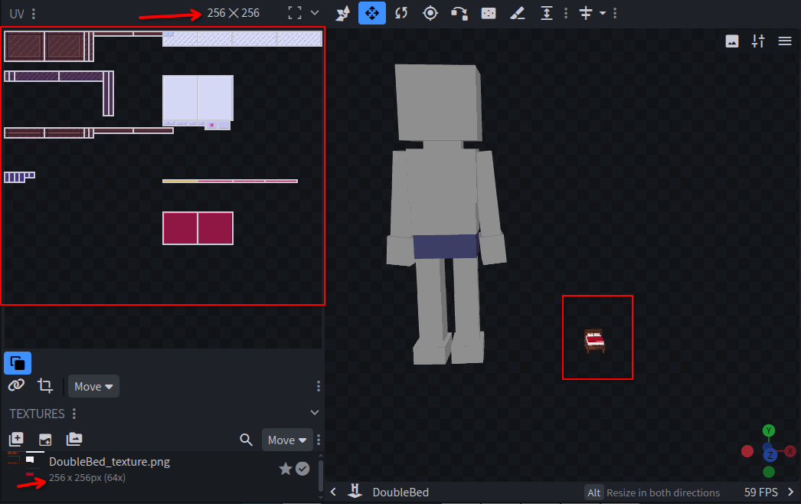
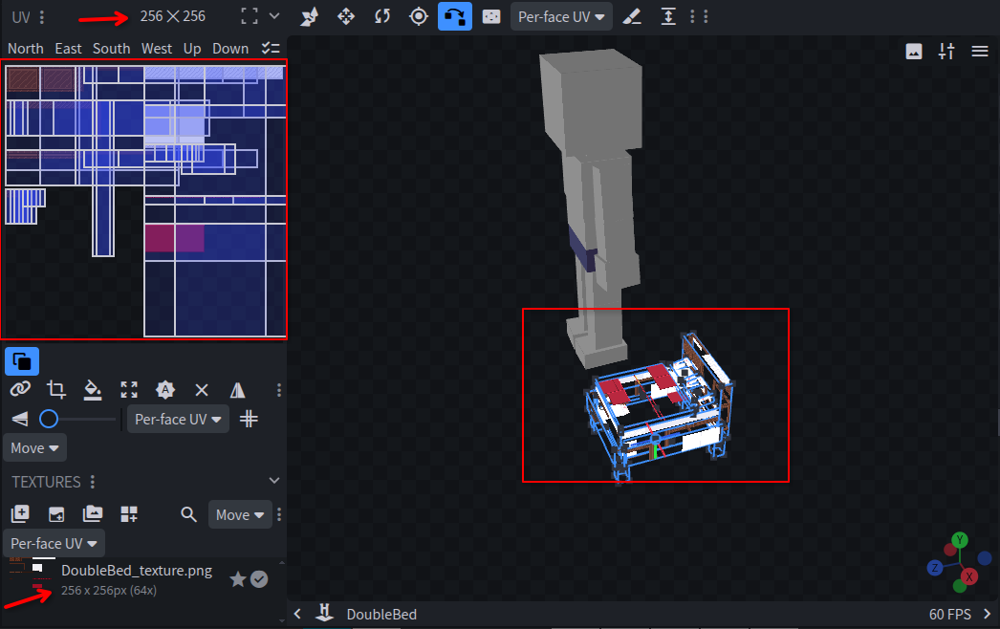
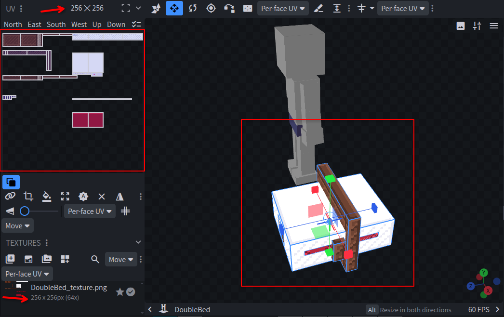
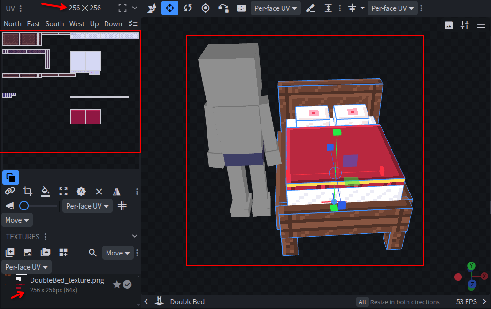

# Hytale Stretch Scaler (Blockbench Plugin)

A standalone Blockbench plugin that scales Hytale models visually in 3D space by any factor **without touching your UV mapping or requiring you to resize your texture files**.



---

## 🛑 The Core Problem: Hytale's UV Constraint

In standard formats (like Minecraft Java/Bedrock), each cube face can have custom UV coordinates with independent widths and heights.

However, the Hytale `.blockymodel` format has a strict limitation: **it does not store UV width or height for faces**.
Looking at the exported JSON structure:
```json
"textureLayout": {
    "front": {
        "offset": {"x": 128, "y": 72},
        "mirror": {"x": false, "y": false},
        "angle": 0
    }
}
```
As you can see, each face only stores the starting `offset` (X/Y coordinates), `mirror`, and `angle`. **The Hytale engine calculates the UV size of each face dynamically from the 3D dimensions of the cube.**

### Why Standard Scaling Breaks Everything:
1. If you use the standard scale tool in Blockbench to make a model 2x larger, the 3D size of your cubes doubles (e.g., from `10` to `20`).
2. Because of Hytale's layout rules, this forces the UV size of the faces to also double (from `10px` to `20px` wide).
3. If your texture remains `256x256`, the UV box is now twice as large, rendering adjacent pixels and ruining your texture mapping.
4. Even if you scale the texture file to `512x512`, the Blockbench scale tool double-scales the UV offsets under the hood, throwing the texture mapping out of place.



---

## 💡 The Solution: Scaling via Stretch

Instead of scaling the logical size of the cubes, this plugin scales the **visual render scale (Stretch)** and adjusts the positions mathematically.

In Hytale, the visual size of a cube in the 3D viewport is determined by:
$$\text{Visual Size} = \text{Logical Size} \times \text{Stretch}$$

By scaling the **Stretch** parameter instead of the logical size, we can double (or multiply by any factor) the visual size of the model, while keeping the logical size of the cubes **exactly the same**. Since the logical size doesn't change, the UV sizes and offsets remain **100% untouched** on the original `256x256` texture!

However, manually changing the stretch of all elements causes their positions to drift and overlap because each cube stretches around its own individual center:



### The Math Behind the Plugin:

When you input a scale factor $F$ (e.g., `2` to double the size, or `8` to go from `0.25` to `2.0` stretch):

1. **Scale Group Pivots:**
   All group/bone origins are multiplied by $F$:
   $$\text{New Origin} = \text{Original Origin} \times F$$
   *This expands the skeleton structure of the model proportionally.*

2. **Scale Cube Pivots:**
   The pivot point of each individual cube is also multiplied by $F$:
   $$\text{New Cube Origin} = \text{Original Cube Origin} \times F$$

3. **Update Stretch:**
   The stretch factor of each cube is multiplied by $F$:
   $$\text{New Stretch} = \text{Original Stretch} \times F$$

4. **Translate Cube Positions (Offsets):**
   To keep the logical offsets identical (so the cubes don't drift or overlap), the new 3D center of the cube must be shifted. Since $\text{Offset} = \text{Center} - \text{Origin}$, we calculate the new center as:
   $$\text{New Center} = (\text{Original Origin} \times F) + (\text{Original Center} - \text{Original Origin})$$
   
   Finally, we update the `from` and `to` coordinates of the cube using the same logical `size`:
   $$\text{New From} = \text{New Center} - \frac{\text{Size}}{2}$$
   $$\text{New To} = \text{New Center} + \frac{\text{Size}}{2}$$

---

## 🚀 How to Use

1. Save the [hytale_stretch_scaler.js](hytale_stretch_scaler.js) file.
2. Drag and drop it into Blockbench to install it.
3. Open your Hytale model (with its original `256x256` texture and perfect UVs).
4. Go to **Tools** > **Scale via Stretch**.
5. Input your desired **Scale Factor** (e.g., `2` to double the visual size).
6. Click **Confirm**. Your model will grow visually in the 3D space, but all UV coordinates will remain perfectly aligned!


